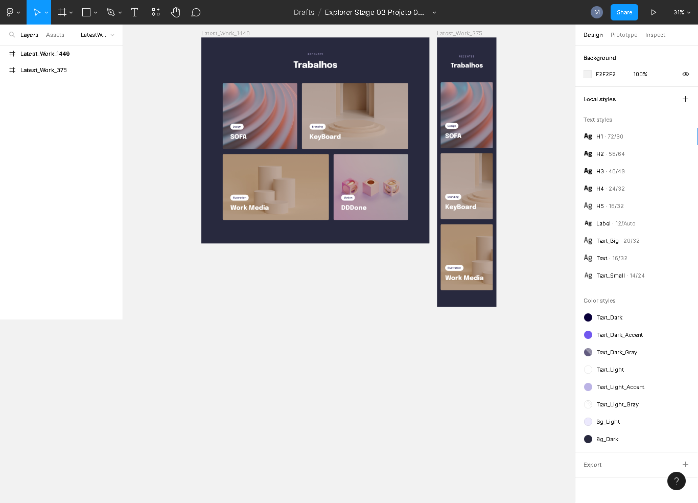

## 🚀 Rockeatseat 
<h1>Stage 03 - Avançando no HTML e CSS</h1>

<h3>Aula 03 - Avançando no CSS</h3>

  

<h4>Descrição</h4>

Nessa aula é apresentado o projeto que iremos desenvolver em aula, trabalharemos com display: grid, transições, animações e responsividade.

Link do Projeto

Arquivo do Projeto no Figma: <a href="https://www.figma.com/file/7XvHCjPR3iq6cVGSICz8ZZ/Explorer-Stage-03-Projeto-03-(Copy)">Explorer / Stage 03 Projeto 03</a>

